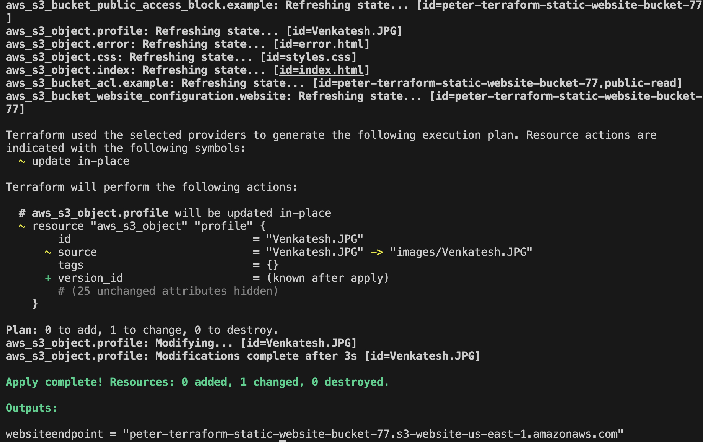
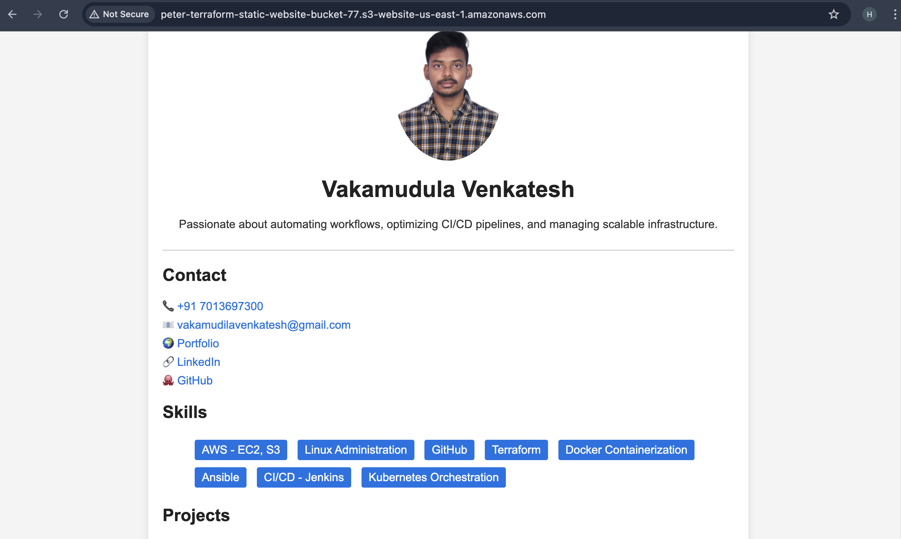

# 📌 Terraform S3 Static Website

## 🚀 Overview
This project automates the deployment of a **static website (resume)** to an **AWS S3 bucket** using **Terraform**.  
The website is publicly accessible and serves an `index.html` file as the homepage.

## 🎯 Features
- ✅ **Terraform automation** for S3 static website hosting.
- ✅ **Publicly accessible website** with `index.html`, `styles.css`, and an optional `error.html`.
- ✅ **Automatic file upload** to S3 via Terraform.
- ✅ (Optional) **Custom domain & HTTPS** can be added later.

## 🏗️ Project Structure
```bash
terraform-resume-project/
│── main.tf          
│── variables.tf     
│── outputs.tf       
│── index.html       
│── styles.css       
│── error.html       
│── images     
│── README.md     
│── .gitignore     
```
## 📸Highlights
1️⃣ Terraform Apply Output

2️⃣ S3 Website in Browser


## 🛠️ Setup & Deployment
1️⃣ Prerequisites
✅ Install Terraform
✅ Have an AWS Account with CLI configured (aws configure)

## 2️⃣ Clone the Repository
git clone https://github.com/VenkateshV14/terraform-s3-website.git
cd terraform-s3-website

## 3️⃣ Initialize Terraform
terraform init

## 4️⃣ Apply Terraform Configuration
terraform apply -auto-approve
## 📌 Note: The output will display the S3 Website URL.

## 🤝 Contributing
Feel free to fork and improve this project! 💡🚀
